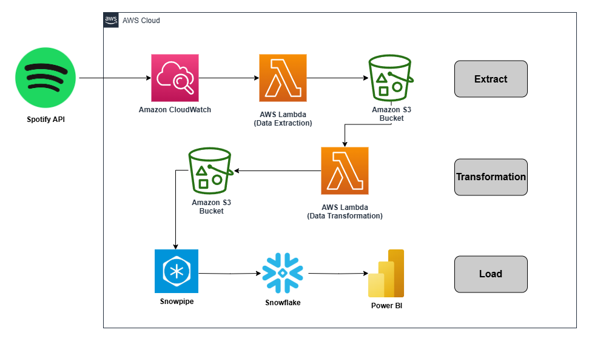

# **End-to-End Spotify Data Pipeline & Analytics**  
End-to-End Spotify Data Pipeline with AWS, Snowflake & Power BI  

## **Overview**  
This project extends my previous **[Spotify Data Engineering Project](https://github.com/anish-gogineni/Spotify_Data_Engineering_Project.git)** by integrating **Snowflake, AWS Lambda, and Snowpipe** for automated data ingestion and analysis. Additionally, I connected **Power BI** to the Snowflake warehouse for data visualization and insights.  

## **Project Architecture**  
The following architecture diagram provides an overview of the **ETL (Extract, Transform, Load) process**:  

  

### **Data Flow**  
1. **Data Extraction**: AWS Lambda extracts data from the **Spotify API** and sends it to an **S3 bucket**.  
2. **Data Transformation**: A second **AWS Lambda function** processes and refines the extracted data.  
3. **Data Ingestion**: Snowpipe automatically loads data from **S3 into Snowflake**.  
4. **Data Analysis & Visualization**: Power BI connects to Snowflake for advanced **data analytics and visualization**.  

## **Technologies Used**  
- **Snowflake** (Data Warehouse)  
- **AWS Lambda** (Serverless Functions)  
- **Amazon S3** (Cloud Storage)  
- **Snowpipe** (Automated Data Ingestion)  
- **SQL & Python** (Data Processing)  
- **Power BI** (Data Visualization)  

## **Tables & Data Flow**  
- `tbl_artist` - Stores artist-related data.  
- `tbl_album` - Stores album details.  
- `tbl_songs` - Stores track-level information.  

## **Power BI Analytics**  
After successfully populating **Snowflake tables**, I connected **Power BI** to the data warehouse and performed **data analytics**. Key insights include:  
✅ **Top Songs by Popularity**  
✅ **Top Artists by Number of Top Songs**  
✅ **Album Release Trends**  
✅ **Most Popular Albums**  

## **Next Steps**  
- Optimize **Snowpipe performance** for faster data ingestion.  
- Expand analytics with **DAX measures** in Power BI.  
- Implement **incremental data refresh** in Power BI for real-time insights.  
